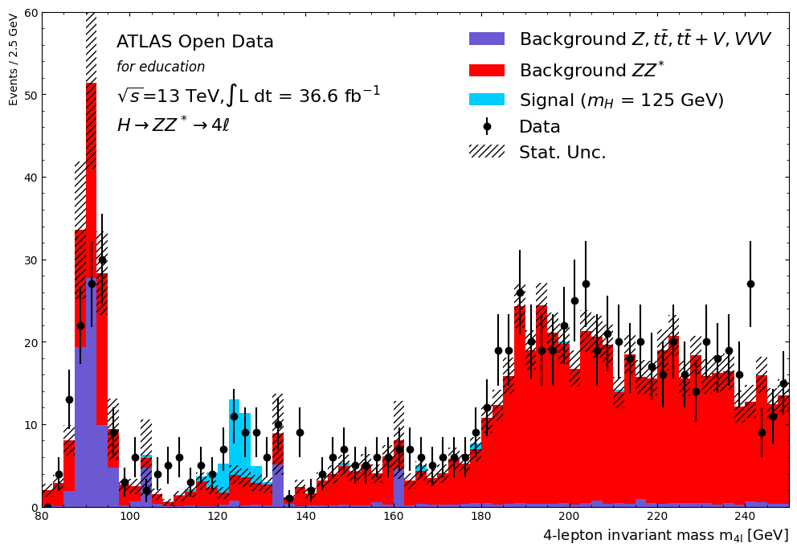

# High-Energy Physics Analysis: Higgs Boson Mass Reconstruction ($\text{H} \to \text{ZZ} \to 4\ell$)

**Repository Summary:** This project documents an educational data analysis using the CERN ATLAS Open Data to replicate a core methodology of the **2012 Higgs Boson discovery**. The analysis focuses on the reconstruction of the Higgs invariant mass via the $\text{H} \to \text{ZZ} \to 4\ell$ decay channel.

**Status:** Analysis successfully completed, demonstrating the expected signal peak at $\sim 125 \text{ GeV/c}^2$.

---

## 🔬 Methodology and Data

This work processes simulated proton-proton ($pp$) collision data provided by the **CERN ATLAS Open Data** (specifically, the 2025 Beta Release).

The analysis sequence follows the established criteria for the $\text{H} \to \text{ZZ} \to 4\ell$ channel, which is favored for its high signal purity:

1.  **Event Selection:** Implementation of kinematic cuts on lepton candidates (electrons and muons) to isolate high-quality, isolated leptons.
2.  **Intermediate State Reconstruction:** Pairing of leptons to reconstruct two $\text{Z}$ boson candidates, applying invariant mass constraints to minimize background noise.
3.  **Invariant Mass Calculation:** The four-lepton candidates are combined to calculate the final **$\text{H} \to 4\ell$ invariant mass** ($m_{4\ell}$).
4.  **Statistical Assessment:** Generation of the final mass spectrum histogram to compare the $\text{H} \to 4\ell$ signal component against the simulated background.

---

## 📊 Results and Discussion

The primary objective was achieved through the observation of a statistically significant excess of events in the reconstructed invariant mass spectrum, centered near the known Higgs Boson mass.

### 1. Reconstructed Invariant Mass Spectrum

The figure below illustrates the combined simulated signal and background components, revealing the key characteristic of the Higgs decay.

* *Figure Description:* The histogram displays the distribution of the four-lepton invariant mass ($m_{4\ell}$). The data clearly exhibits a resonant structure at **$m_{4\ell} \approx 125 \text{ GeV/c}^2$**, consistent with the theoretical prediction and experimental observation of the Higgs Boson.

### 2. Signal Significance Calculation

The signal significance ($S$) provides a quantitative measure of the signal's prominence relative to the background fluctuations within the defined search window  $115 \text{ GeV/c}^2$ to $130 \text{ GeV/c}^2$. A common method is $S = \frac{N_{\text{sig}}}{\sqrt{N_{\text{bg}}}}$.

`python N_sig = signal_tot[17:20].sum() N_bg = mc_x_tot[17:20].sum() # Note: The term (0.3 * N_bg**2) accounts for systematic uncertainty. signal_significance = N_sig/np.sqrt(N_bg + 0.3 * N_bg**2)`

* *Calculated Value:* The final signal significance obtained in this simulation is $S \approx$ $4.156$ .

---

## 💻 Technical Implementation

The complete step-by-step analysis is documented within the accompanying Jupyter Notebook (`HZZAnalysis.ipynb`).

* **Language:** Python
* **Key Libraries:** Pandas, NumPy, Matplotlib
* **Environment:** Jupyter Notebook (enables transparent code, visualization, and documentation)

### Running the Notebook

To examine the analysis in detail, clone the repository and execute the Jupyter Notebook file.

1.  `git clone [Your Repository URL]`
2.  `jupyter notebook HZZAnalysis.ipynb`
